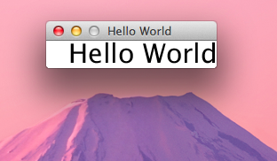

<blockquote class="twitter-tweet" lang="ja">
Scala Advent Calendar jp 2011 24日目を書きました。 <a href="http://t.co/18VTM9iL" title="http://kiyoshih.github.com/ScalaAdventCalendarJp2011/">kiyoshih.github.com/ScalaAdventCal…</a>
&mdash; kiyoshi hosodaさん (@kiyoshih) <a href="https://twitter.com/kiyoshih/status/150515160690335744" data-datetime="2011-12-24T09:56:25+00:00">12月 24, 2011</a></blockquote>

### Hello World ###

*このリポジトリはScala Advent Calendar jp 2011の24日目です。*

* ここでは事前にsbtがインストールされているものとして進めます。
* MacOS X 10.7、sbt0.11で実行しています。

#### JavaFXをインストールします。 ####

* インストーラを以下のページよりダウンロードし、インストールします。
* [JavaFX Downloads](http://javafx.com/downloads/)

#### プロジェクト用のディレクトリにbin,libディレクトリを作成し、JavaFXのランタイムをコピーします。 ####

<pre class="prettyprint">
$ cd /path/to/project
$ mkdir lib bin
$ cp /path/to/javafxinstalldir/rt/lib/jfxrt.jar ./lib
$ cp /path/to/javafsinstalldir/rt/bin/* ./bin
</pre>

* Mavenリポジトリが見つからなかったのと、ネイティブライブラリが必要だったため、アンマネージ依存ライブラリとしています。
* jfxrt.jarが../binのライブラリを参照するため、このようなディレクトリ構成としています。

#### build.sbtを作成します。 ####

<pre class="prettyprint">
name := "javafxscala"

version := "1.0"

scalaVersion := "2.9.1"

fork in run := true
</pre>

* <code>fork in run := true</code>とすることで、runしたときに新しいJVMで起動します。

#### srcディレクトリを作成します。 ####

<pre class="prettyprint">
mkdir -p src/main/scala
</pre>

#### HelloWorld.scalaを作成します。 ####

<pre class="prettyprint lang-scala">
import javafx.application.Application
import javafx.stage.Stage
import javafx.scene.{Group, Scene}
import javafx.scene.text.{Font, Text}

class HelloWorldJFX extends Application {

  override def start(stage: Stage) = {
    val text = new Text(25, 25, "Hello World")
    text.setFont(new Font(30))
    val scene = new Scene(new Group(text))
    stage.setTitle("Hello World")
    stage.setScene(scene)
    stage.sizeToScene
    stage.show
  }
}

object HelloWorldJFX {
  def main(args: Array[String]) = Application.launch(classOf[HelloWorldJFX], args:_*)
}
</pre>

* JavaFX 2.0では以前のような宣言的なUIの定義が出来なくなっています。
   * JavaFX Scriptとして別のプロジェクトになっています。
   * ScalaFXを利用するか、自分でラッパーを作る事で宣言的に定義することが可能です。

#### 実行します。 ####

<pre class="prettyprint">
$ sbt run
</pre>

### PathTransition ###

せっかくなので、動きのあるサンプルです。

<pre class="prettyprint lang-scala">
import javafx.application.Application
import javafx.stage.Stage
import javafx.scene.{Group, Scene}
import javafx.scene.paint.Color
import javafx.scene.shape.{CubicCurveTo, MoveTo, Path, Rectangle}
import javafx.animation.{Animation, PathTransition}
import javafx.animation.PathTransition.OrientationType
import javafx.event.EventHandler
import javafx.util.Duration

class PathTransitionSample extends Application {

  private lazy val pathTransition = new PathTransition

  private def init(stage: Stage) : Unit = {
    val root = new Group
    stage.setResizable(false)
    stage.setScene(new Scene(root, 400, 260))

    val rect = new Rectangle(0, 0, 40, 40)
    rect.setArcHeight(10)
    rect.setArcWidth(10)
    rect.setFill(Color.ORANGE)
    
    root.getChildren().add(rect)

    val path = new Path
    path.getElements().add(new MoveTo(20, 20))
    path.getElements().add(new CubicCurveTo(380, 0, 380, 120, 200, 120))
    path.getElements().add(new CubicCurveTo(0, 120, 0, 240, 380, 240))
    path.setStroke(Color.DODGERBLUE)
    path.getStrokeDashArray().setAll(5d, 5d)

    root.getChildren().add(path)

    pathTransition.setDuration(Duration.seconds(4))
    pathTransition.setPath(path)
    pathTransition.setNode(rect)
    pathTransition.setOrientation(OrientationType.ORTHOGONAL_TO_TANGENT)
    pathTransition.setCycleCount(Animation.INDEFINITE)
    pathTransition.setAutoReverse(true)
  }

  private def play = pathTransition play

  override def stop = pathTransition stop

  override def start(stage: Stage): Unit = {
      init(stage)
      stage.show
      play
  }
}

object PathTransitionSample {
  def main(args: Array[String]) = Application.launch(classOf[PathTransitionSample], args: _*)
}
</pre>

* 宣言的にUIを定義するためのラッパーを書いていたのですが、中途半端なのでやめておきます。
* ScalaFXは大してコード量も多くないので、興味のある人はソースを読むとよいと思います。

### おまけ ###

このページはgithubのプロジェクトページで作成してみました。

以下を利用しています。

* [github:pages](http://pages.github.com/)
* [jekyll](https://github.com/mojombo/jekyll/)
* [Bootstrap](http://twitter.github.com/bootstrap/)
* [Google Code Prettify](http://code.google.com/p/google-code-prettify/)
